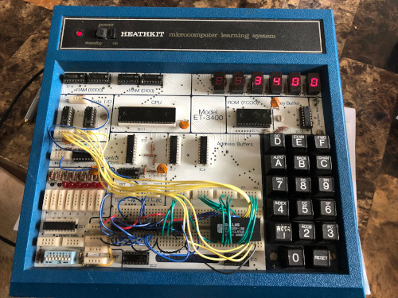

# About Dragon Framework

## Why Dragon Framework?

Dragon Framework exists to make it extremely easy to write WordPress plugins using Laravel components. (Psst... Are you building a theme? You'll want to use Acorn instead.)

Under the hood, the Dragon Framework uses [Acorn](https://roots.io/acorn/docs/) to do the heavy lifting of integrating WordPress with Laravel, but the Dragon Framework takes it to the next level. This means, that you're free to use both Laravel Packages, as well as [Acorn Packages](https://roots.io/acorn/docs/available-packages/#user-contributed), in addition to other WordPress plugins.

You also have access to the Acorn command line tool by running `wp acorn` which acts similarly to Laravel's `artisan` command, but adds Acorn-specific commands.

## Why not just use Acorn instead?

The Dragon Framework isn't just Acorn, but a collection of tools to improve on WP code, and offers skeleton code to fast track getting started with the Dragon Framework.

Acorn is designed for theme development first, and there are a LOT of things that get quite complicated when trying to use it for plugin development. While Acorn does provide immense value in plugin development, Acorn's goal is to provide a theme-first framework, so things like [making shortcodes](../walkthroughs/create-a-shortcode) that run on routes aren't at all easy without the Dragon Framework. Instead routes just run your code on a blank page without WordPress styling when you write WP plugins with Acorn. You need Dragon Framework to virtualize routes for display through shortcodes, blocks, or admin pages.

If you're looking for a theme-first toolkit, we highly recommend using Acorn directly, not the Dragon Framework which is created for WordPress plugin development. Acorn is built by Roots, and they have a whole ecosystem of awesome theme-first tools, such as their own starter theme called Sage.

## Why not just use Laravel components directly?

Dragon Framework 1.x did in fact use Laravel components directly. For many years it provided an easy to work with system of tools using Laravel. It was missing controllers, routes, and a slew of other features available in 2.x. Hundreds of our client projects ran on Dragon Framework 1.x. That saved countless hours of development time, and saved our clients thousands of dollars. 2.x is a full rewite of the Dragon Framework, and carries over a few tools from 1.x.

Laravel is a complex system of components that are very difficult to seperate. It's not like Symfony which Laravel relies on for many of it's features, such as `Request` and `Cookie` management. There are ways to [use Laravel components on their own](https://github.com/mattstauffer/Torch/tree/master), though.

## Why not just use Symfony?

Laravel adds a LOT of tooling on top of Symfony's building blocks. Yes, Symfony is a framework, and you're free to choose whichever framework you'd like. Symfony relies on PHP, and PHP has it's own classes, functions, and even language constructs to build whatever you'd like. It also integrates with many databases. So, that brings us to our next question...

## Why not just use PHP?

PHP is a programming language written in C and C++. It provides a fine grained approch to build... well, anything! You can even package up your code inside of a single file that can be run on the command line, or even run scripts from the command line. You'll however, find yourself spending countless hours building things like security, template engines, a database ORM, and other things that work out of the box in a modern framework.

## If PHP relies on C and C++, why not use those?

C++ got its name from being "one more than C". C++ is built in C, and it's a C framework. PHP takes C and C++ and adds an entire web toolkit to these general purpose programming languages. While you can compile PHP, it's meant as a scripting language. C and C++ are compiled into Assembler code, and then into binary. C can run on embedded devices, but C++ needs an SDK to run, and usually doesn't work so well with embeded devices. PHP usually isn't found on embeded devices for that reason either. C++ just makes C object oriented.

## If C++ and C compile to Assembler, why not use Assembler?

Dennis Ritchie invented C in Bell Labs back in the 1970s. (Sound familiar? Yeah, the Unix timestamp starts at 1/1/1970!) C was created in assembler because assembler is complicated to use and isn't written using English-like structure. (`MOV AL, 61h` isn't as readable as `if (my_val != 0) {print("Here");}`.) Assembler was created to replace machine code, though. If you want to spend hours building an entire programming language so you can build a website, have fun with assembler. :P

## If Assembler was written to replace machine code...

We can keep going down the rabbit hole. :) Machine code is specific to the individual central processing unit (CPU), the chip on your computer's motherboard. It needs specific instructions, and assembler unifies these languages in a way all chips can understand. While assembler compiles to binary, it was created as an alternative to machine code specific languages. I hope you're great at hex, cowboy, as machine code looks like this: `0x 60 00 00 80`.

Back in high school, I remember learning hex on an old Heathkit trainer. It took me over an hour to load all that hex into the processor and I still got it wrong. (No fixing typos...)

*Heathkit ET3400 Trainer*

## What does machine code replace?

Binary. Punch cards. Yep. Pretty much the end of the line at this point.
